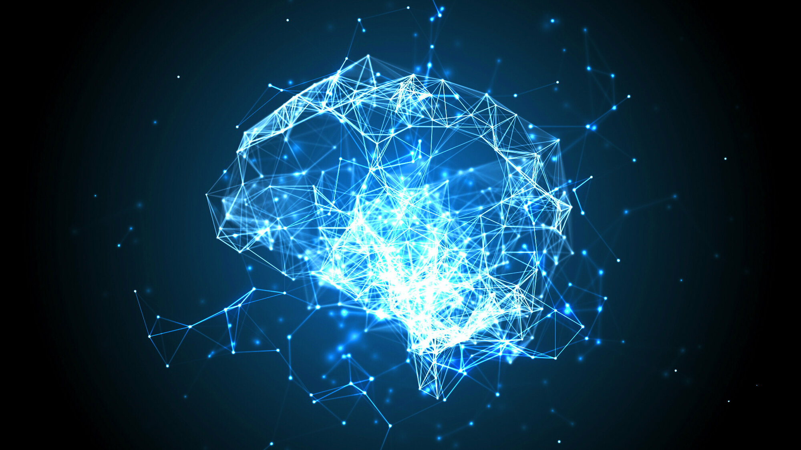

# Inteligencia Artificial y Aprendizaje Automático

---

**Fecha:** 21 de abril a 21 mayo de 2024  

**Responsable:** Dr. Ulises Olivares Pinto  

**Auxiliares:** Fernando Ramírez González

## Objetivo General
Desarrollar una comprensión profunda y aplicada de los principios y técnicas fundamentales de la inteligencia artificial y el aprendizaje profundo, capacitando a los participantes para diseñar, implementar y evaluar soluciones avanzadas en diversos contextos y problemas reales.

## Objetivos Específicos
- Entender los principios fundamentales de la IA y el aprendizaje profundo.
- Dominar el uso de redes neuronales en aplicaciones prácticas.
- Aplicar aprendizaje profundo a la visión por computadora y al NLP.
- Experimentar con la creación de datos mediante modelado generativo.
- Implementar aprendizaje por refuerzo para la toma de decisiones autónoma.
- Completar proyectos que integren teoría y práctica de IA.
- Seguir las tendencias actuales y emergentes en IA.
- Considerar la ética en el desarrollo y aplicación de la IA.

## **Modalidad:** 
>Presencial  
## **Prerrequisitos:** 
+ Computadora personal con acceso a internet
+ Cuenta de Gmail
+ Conocimientos básicos de programación.

## Temario

| Sesiones    | Tema                                                               | Subtemas                                                                                                                                                   | Material de Consulta                                                                                                     | Ejercicios y Demostraciones | Presentación                |
|-------------|--------------------------------------------------------------------|-------------------------------------------------------------------------------------------------------------------------------------------------------------|---------------------------------------------------------------------------------------------------------------------------|----------------------------|-----------------------------|
| Sesión 1    | Introducción a la IA y Aprendizaje Profundo                        | <ul><li>Historia y Fundamentos de la IA</li><li>Diferencias entre ML y AP</li><li>Aplicaciones y Casos de Éxito</li></ul>                                    | ["Artificial Intelligence: A Modern Approach" por Stuart Russell y Peter Norvig](https://www.amazon.com/Artificial-Intelligence-Modern-Approach-3rd/dp/0136042597) |   <ul><li>[Demo 1: Modelado generativo](https://colab.research.google.com/drive/1UXRuaYiXz6_S0KqZj2576AyQvpIES0UE?usp=sharing)</li><li>[Demo 2: YOLO](https://colab.research.google.com/drive/1oUqRgH4FXOQDDOx72Z1Pk7xwZrT0nSUq?usp=sharing)</li><li>[Demo 3: Reconocimiento de emociones](https://colab.research.google.com/drive/1Y3g8LIlzQOJ4OfiAKPJ9aAKqFrpHdNZj)</li><li>[Demo4: Generación de modelos 3D](https://colab.research.google.com/drive/1P6zzpwSPkiL3kezFM1Up47SAd5oKbaDk?usp=sharing)</li></ul>  | [Presentación](pdf/Día1.pdf) |

#### Última modificación: 21 de abril de 2025
